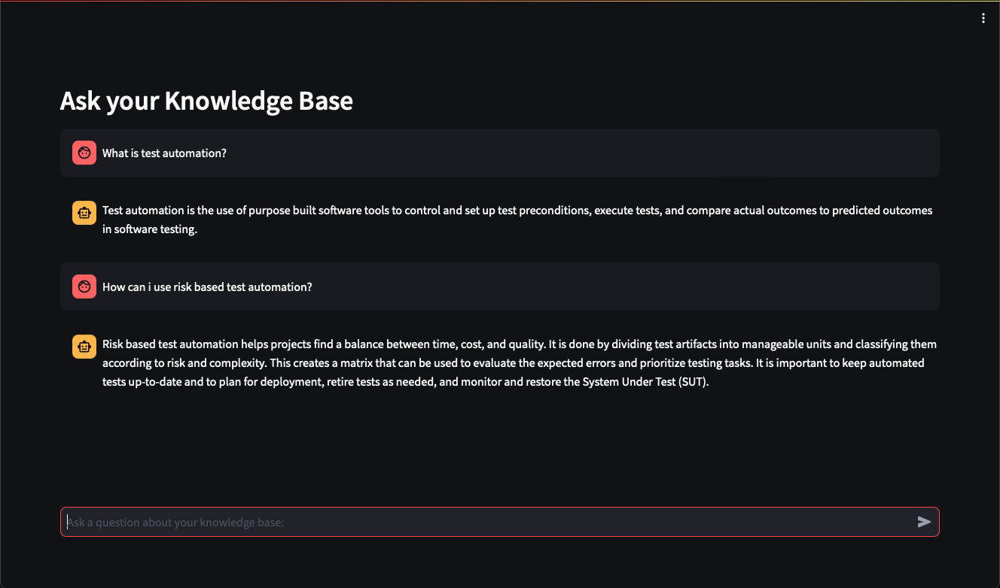
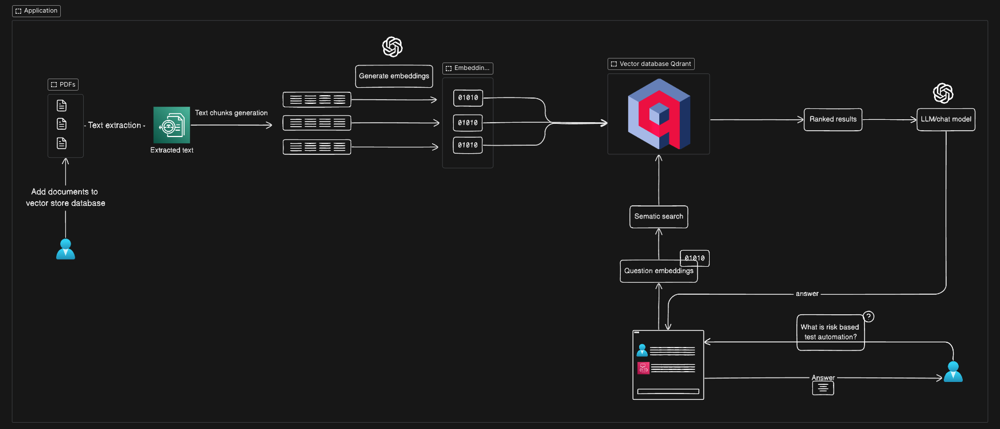

# PDF Chat App with Qdrant

## Description

The PDF Chat App is a unique application that allows users to upload PDF files to a vector database and chat with its content using a LLM like the GPT-3.5 Turbo model or higher. 

It is build one the Streamlit framework, it enables an interactive web interface where users can seamlessly interact with their knowledge base. The underlying architecture leverages the power of Qdrant as a vector database to make the interactions fast and relevant.

## Preview
<p align="center">
  
</p>

## Architecture
<p align="center">
  
</p>

## Features

- **PDF Upload**: Easily upload your PDFs and extract their content.
- **Interactive Chat**: Engage in a conversation with the content of your PDF using the GPT-3.5 Turbo model.
- **Efficient Retrieval**: With Qdrant as the vector database, get quick and relevant responses.

## Frameworks & Libraries
- **Streamlit**: Used for creating the interactive web interface.
- **Qdrant**: Enables efficient retrieval of chat responses through its vector store capabilities.
- **Langchain**: A crucial framework for developing applications powered by language models.
- **GPT-3.5 Turbo**: The language model used for chat interactions.
- **PyPDF2**: Used for PDF file interactions.
- **tiktoken**: Likely used for tokenizing text.
- **OpenAI**: Library for OpenAI API interactions.

## Installation & Setup

### **Clone the Repository**

```bash
git clone https://github.com/MicheleCandolfo/PDF-Chat-App-with-vector-database
```

### **Navigate to the Directory**

```bash
cd path-to-repo
```


### **Install the Dependencies**

Before running the app, ensure you have the necessary dependencies installed.

```bash
pip install -r requirements.txt
```

### **Set up an .env file with your QDRANT and OPENAI API KEYS**

```env
QDRANT_HOST=<Your Qdrant Host>
QDRANT_API_KEY=<Your Qdrant API Key>
OPENAI_API_KEY=<Your OpenAI API Key>
```
### **Create a qdrant client and a collection**
1. Create a cluster at the qdrant website -> https://qdrant.tech.
2. Add the qdrant host as well as the API key to the created .env file. 
3. Add the collection name in the qdrant.ipynb file.
4. Add the specific PDF file to the qdrant.ipynb file.
5. Execute the qdrant ipynb file to create a client, collection, vector store, add documents to the vector store and initialize a retrieval-based question-answering system and testing it.

### **Run the Streamlit App**

```bash
streamlit run pdf-chat-app-with-qdrant.py
```

## Usage

After successfully setting up the project:

1. Navigate to the Streamlit interface.
2. Engage in a chat with your knowledge base.

## Feedback & Suggestions

While contributions aren't currently open, feedback and suggestions are always welcome. Please open an issue in the repository for any queries or suggestions.
